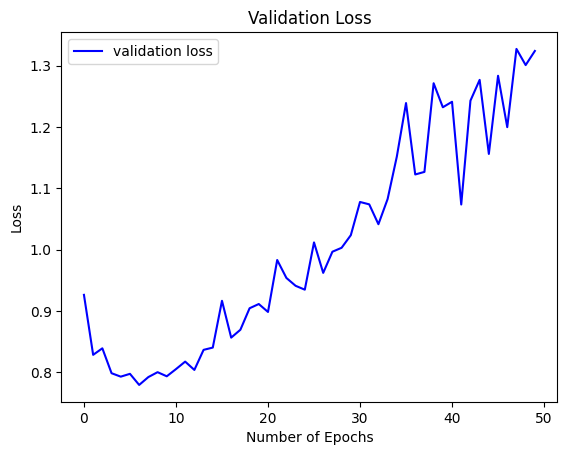
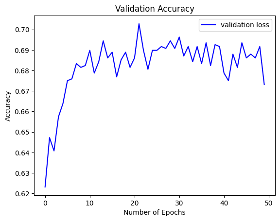
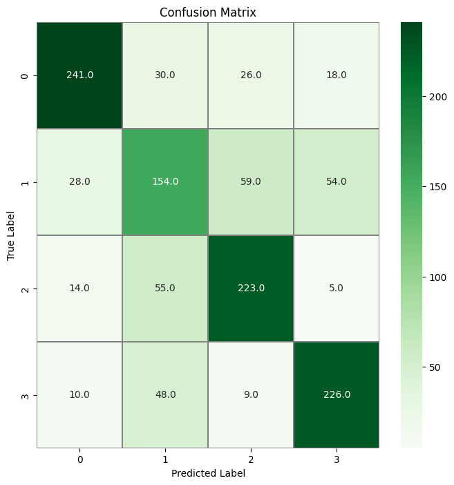
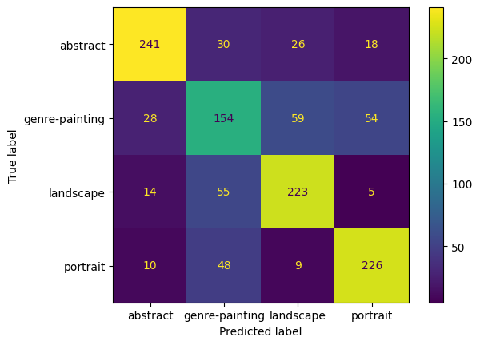
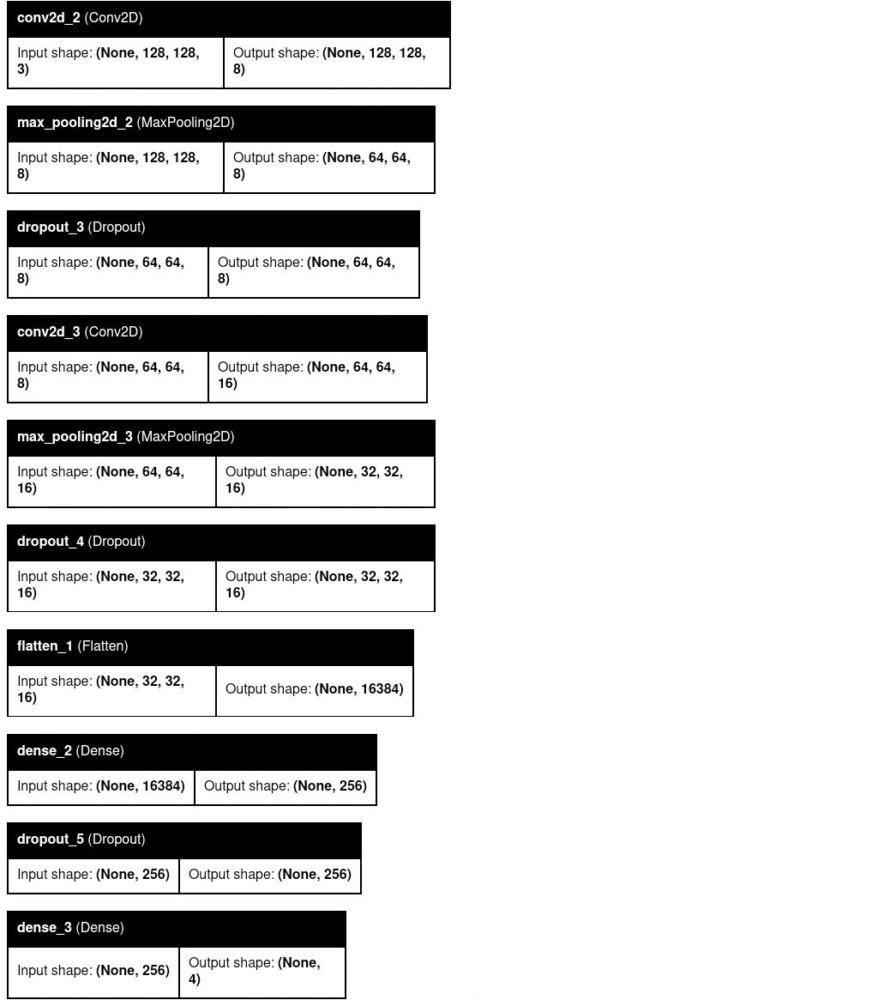
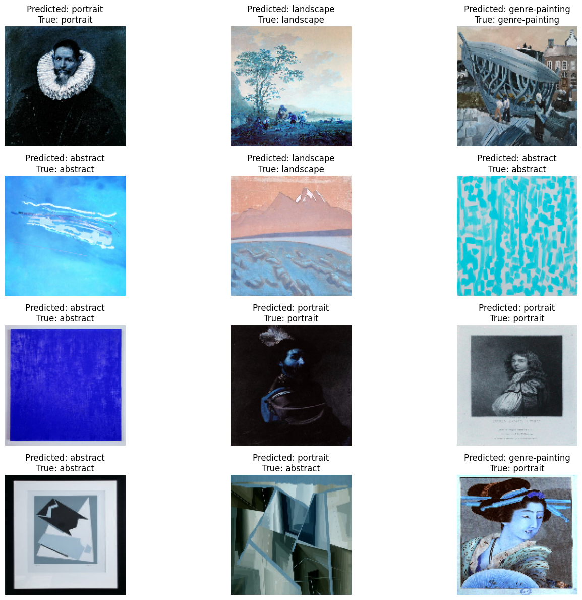
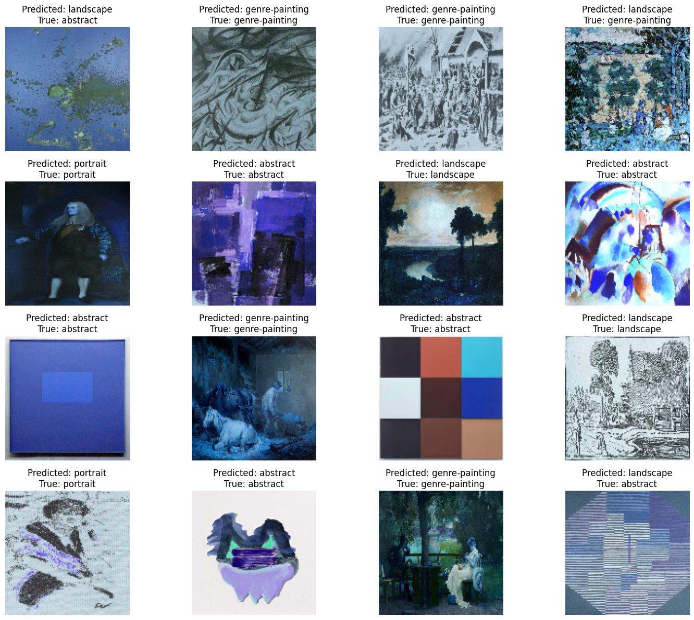

# Art_Classification_v4

The goal of the project is to create a model that classifies images painted in 4 categories: abstract art, genre painting, landscape and portrait. The model was trained on about 60000 images - ~15000 images per category and during preprocessing they were resized to 128x128. Images come from the WikiArt database.

I also created a web app that uses this model to classify images. You can start it by running:

`./app/backend > flask run`

`./app/frontend > npm run dev`

### fully trained model - best accuracy

accuracy on test data: 70.34%

trained on 128x128 images, ~15000 images per class

```python
model = Sequential()

model.add(Conv2D(filters = 8, kernel_size = (5,5),padding = 'Same',
                 activation ='relu', input_shape = (Image_size,Image_size,3)))
model.add(MaxPool2D(pool_size=(2,2)))
model.add(Dropout(0.25))

model.add(Conv2D(filters = 16, kernel_size = (3,3),padding = 'Same',
                 activation ='relu'))
model.add(MaxPool2D(pool_size=(2,2), strides=(2,2)))
model.add(Dropout(0.25))
model.add(Flatten())
model.add(Dense(256, activation = "relu"))
model.add(Dropout(0.5))
model.add(Dense(len(Art_Categories), activation = "softmax"))
```





### Example images with predicted and true labels:



