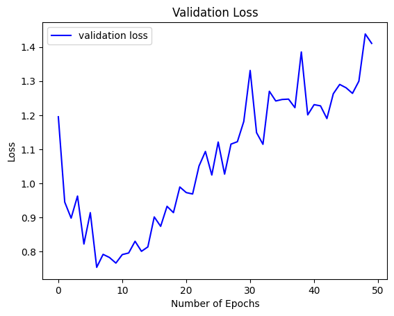
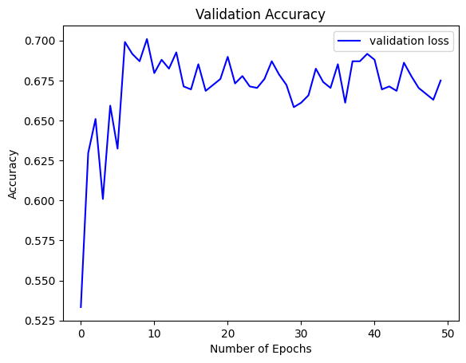
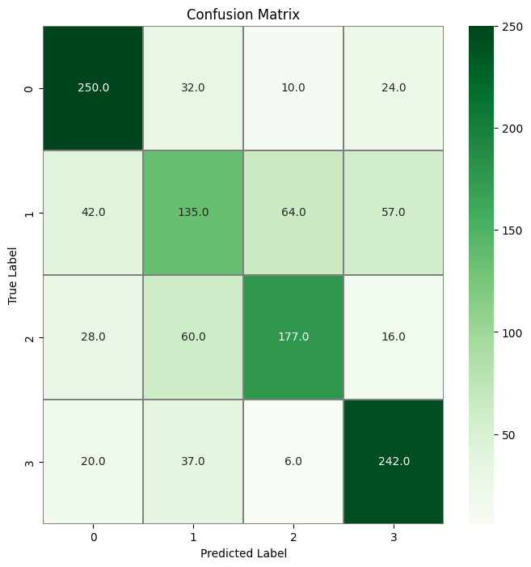

# Art_Classification_v4

Celem projektu jest stworzenie modelu klasyfikującego obrazy malowane w 4 kategorie: abstract art, genre painting, landscape i portrait. Model został wytrenowany na około 60000 obrazach - ~15000 obrazów na kategorię i w trakcie preprocessingu były zmniejszane do rozmiaru 128x128. Obrazy pochodzą z bazy danych WikiArt.

### prototyp



### accuracy on test data: 68.3%

### fully trained model:

trained on 128x128 images, ~15000 images per class


### accuracy on test data: 70.34%


```python
model = Sequential()

model.add(Conv2D(filters = 8, kernel_size = (5,5),padding = 'Same',
                 activation ='relu', input_shape = (Image_size,Image_size,3)))
model.add(MaxPool2D(pool_size=(2,2)))
model.add(Dropout(0.25))

model.add(Conv2D(filters = 16, kernel_size = (3,3),padding = 'Same',
                 activation ='relu'))
model.add(MaxPool2D(pool_size=(2,2), strides=(2,2)))
model.add(Dropout(0.25))
model.add(Flatten())
model.add(Dense(256, activation = "relu"))
model.add(Dropout(0.5))
model.add(Dense(len(Art_Categories), activation = "softmax"))
```

Example images with predicted and true labels:


