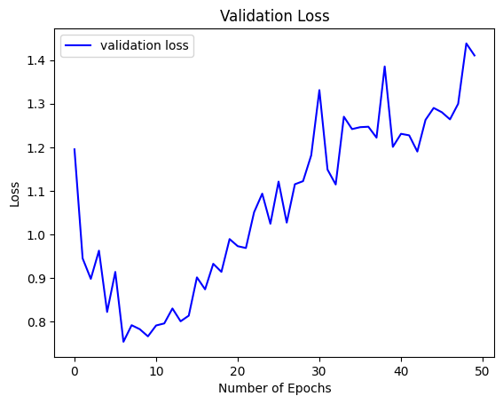
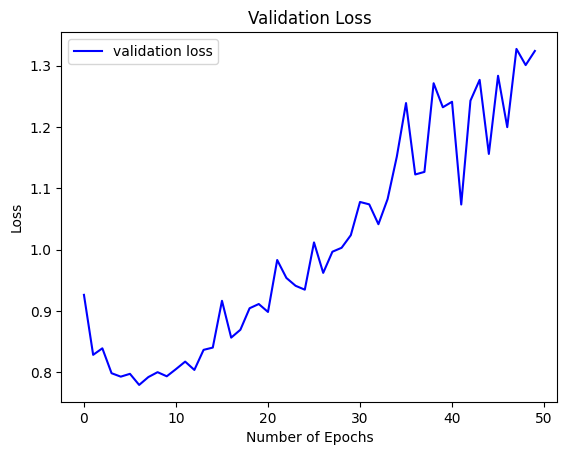
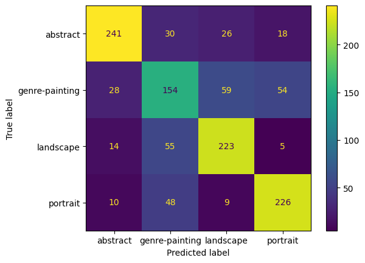
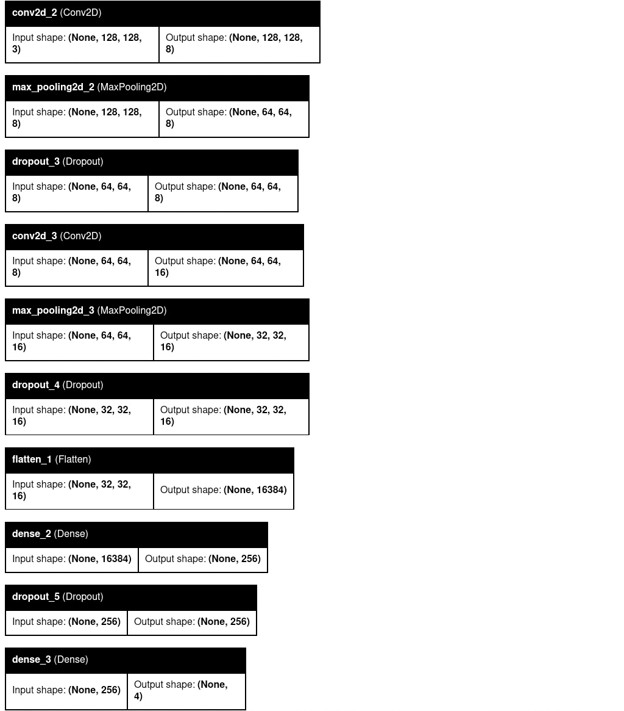

# First model - Art_Classification_four

## prototype

### accuracy on test data: 68.3%

## fully trained model:

trained on 128x128 images, ~15000 images per class

### accuracy on test data: 70.34%

